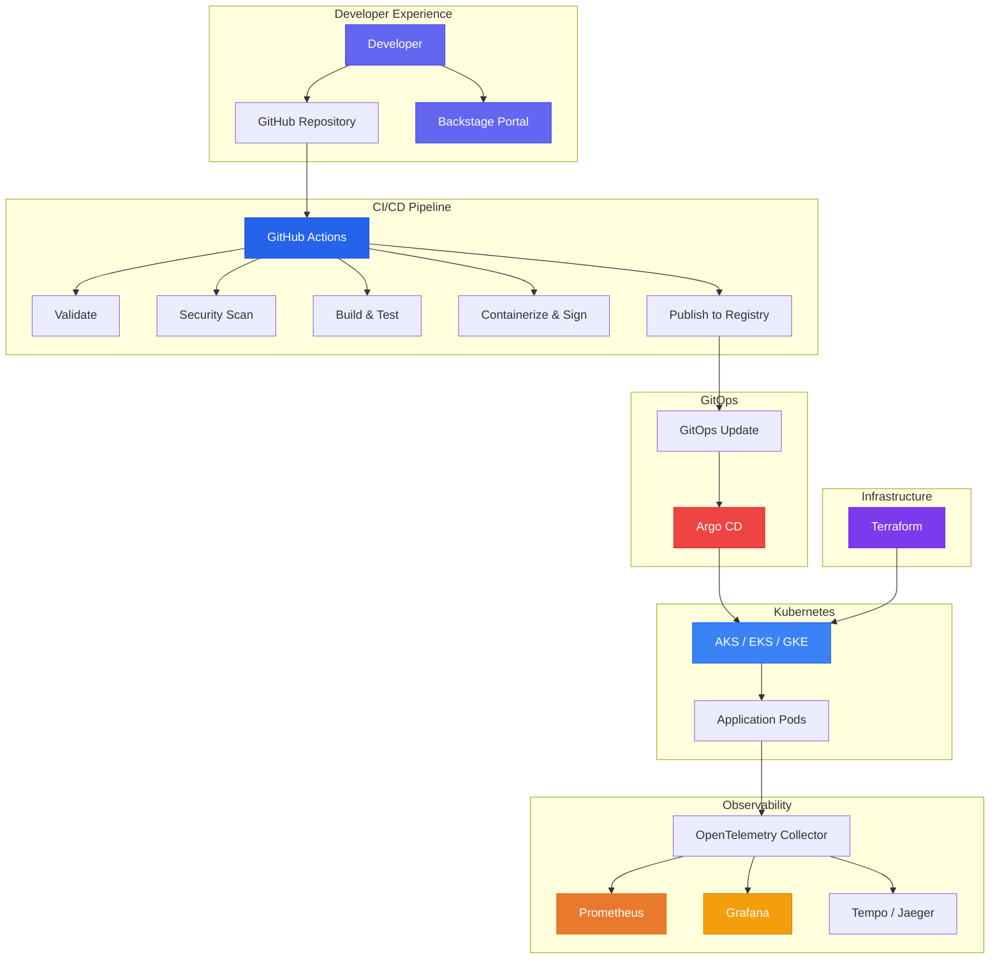

# 🚀 Platform Engineering Accelerator

[](https://github.com/YOUR_ORG/platform-engineering-accelerator/actions)
[](https://github.com/YOUR_ORG/platform-engineering-accelerator/actions)
[](LICENSE)

A **production-grade, cloud-agnostic** platform engineering blueprint that automatically provisions, deploys, secures, monitors, and operates Kubernetes workloads. Clone it, provide minimal inputs, and get a fully operational service with CI/CD, GitOps, observability, and security baked in.

---

## 🏗️ Architecture

```
Developer
  → GitHub Repository
    → GitHub Actions (CI/CD)
      → Infrastructure Validation
      → Security Validation
      → Artifact Build & Sign
      → Container Registry (GHCR / ACR / ECR / GCR)
        → GitOps Repository Update
          → Argo CD (Sync)
            → Kubernetes Cluster (AKS / EKS / GKE)
              → Monitoring & Observability
```



---

## ✨ Features

| Category | Capabilities |
|---|---|
| **CI/CD** | 9 reusable GitHub Actions workflows, matrix builds, fail-fast |
| **GitOps** | Argo CD auto-sync, self-heal, drift detection, rollback |
| **Security** | CodeQL, Trivy, Checkov, Syft SBOM, Cosign signing, OPA policies |
| **Observability** | Prometheus, Grafana dashboards, OpenTelemetry, auto-instrumentation |
| **Infrastructure** | Terraform modules for AKS, EKS, GKE with remote state |
| **Kubernetes** | Helm charts, HPA, PDB, NetworkPolicies, security contexts |
| **Developer Portal** | Backstage templates for 5 runtimes with self-service onboarding |
| **Alerting** | CPU, Memory, Pod Restart, CrashLoop, Latency, Error Rate alerts |
| **Deployment** | Rolling, Canary, Blue/Green strategies |
| **Governance** | CODEOWNERS, branch protection, signed commits, approval gates |

---

## 🎯 Supported Runtimes

| Runtime | API Template | Frontend Template | Worker Template |
|---|---|---|---|
| .NET | ✅ | — | ✅ |
| Node.js | ✅ | — | — |
| Python | ✅ | — | — |
| React | — | ✅ | — |
| Java | ✅ (via customization) | — | — |
| Go | ✅ (via customization) | — | — |

---

## 🚀 Quickstart

### Prerequisites

- [Docker](https://docs.docker.com/get-docker/)
- [kubectl](https://kubernetes.io/docs/tasks/tools/)
- [Helm](https://helm.sh/docs/intro/install/) >= 3.12
- [Terraform](https://developer.hashicorp.com/terraform/install) >= 1.5
- [Argo CD CLI](https://argo-cd.readthedocs.io/en/stable/cli_installation/)

### 1. Clone & Bootstrap

```bash
git clone https://github.com/YOUR_ORG/platform-engineering-accelerator.git
cd platform-engineering-accelerator
make bootstrap
```

### 2. Generate a New Service

```bash
./scripts/generate-service.sh \
  --name my-api \
  --runtime dotnet \
  --port 8080 \
  --replicas 3
```

This generates:
- Source code scaffold
- Multi-stage Dockerfile
- GitHub Actions CI/CD pipeline
- Helm chart with environment-specific values
- Argo CD application manifest
- OpenTelemetry configuration
- Prometheus ServiceMonitor
- Grafana dashboard
- Backstage catalog entry
- Documentation

### 3. Deploy Infrastructure

```bash
cd platform/terraform
terraform init
terraform plan -var-file=environments/dev/terraform.tfvars
terraform apply -var-file=environments/dev/terraform.tfvars
```

### 4. Install Platform Components

```bash
make setup-argocd
make setup-monitoring
make setup-otel
```

### 5. Push & Deploy

```bash
git add . && git commit -m "feat: add my-api service"
git push origin main
# GitHub Actions → Argo CD → Kubernetes (automatic)
```

---

## 📁 Repository Structure

```
.github/
  workflows/               # 9 reusable workflows + orchestrator
  actions/                  # Composite actions

platform/
  terraform/
    modules/                # networking, kubernetes, storage, monitoring, identity, security
    environments/           # dev, qa, uat, prod
  kubernetes/
    base/                   # Base Kustomize manifests
    overlays/               # Environment-specific overlays
    helm/                   # Helm chart
  argocd/
    applications/           # Argo CD application definitions
    strategies/             # Deployment strategies

backstage/
  templates/                # Scaffolder templates
  catalog/                  # Service catalog

monitoring/
  prometheus/               # Prometheus configuration
  grafana/                  # Dashboards & datasources
  alerts/                   # PrometheusRule alert definitions

observability/
  otel/                     # OpenTelemetry Collector config
  collectors/               # Auto-instrumentation configs

security/
  policies/                 # OPA/Rego policies
  scanning/                 # Scanner configurations

golden-templates/           # Starter templates per runtime
  dotnet-api/
  node-api/
  python-api/
  react-app/
  worker-service/

scripts/                    # Automation scripts
docs/                       # Architecture, runbooks, guides
```

---

## 🔧 Configuration

All configurations follow convention-over-configuration. The minimal inputs for a new service:

| Input | Description | Default |
|---|---|---|
| `serviceName` | Name of the service | (required) |
| `runtime` | Runtime/language | (required) |
| `port` | Application port | `8080` |
| `replicaCount` | Number of replicas | `2` |

Everything else (CI/CD, Helm, Argo CD, monitoring, tracing, security) is automatically generated.

---

## 📖 Documentation

- [Architecture Guide](docs/architecture.md)
- [Deployment Guide](docs/deployment-guide.md)
- [Developer Onboarding](docs/onboarding.md)
- [Security Practices](docs/security.md)
- [Troubleshooting](docs/troubleshooting.md)
- [Runbooks](docs/runbooks/)

---

## 🤝 Contributing

See [CONTRIBUTING.md](CONTRIBUTING.md) for guidelines.

---

## 📄 License

This project is licensed under the MIT License — see [LICENSE](LICENSE) for details.
