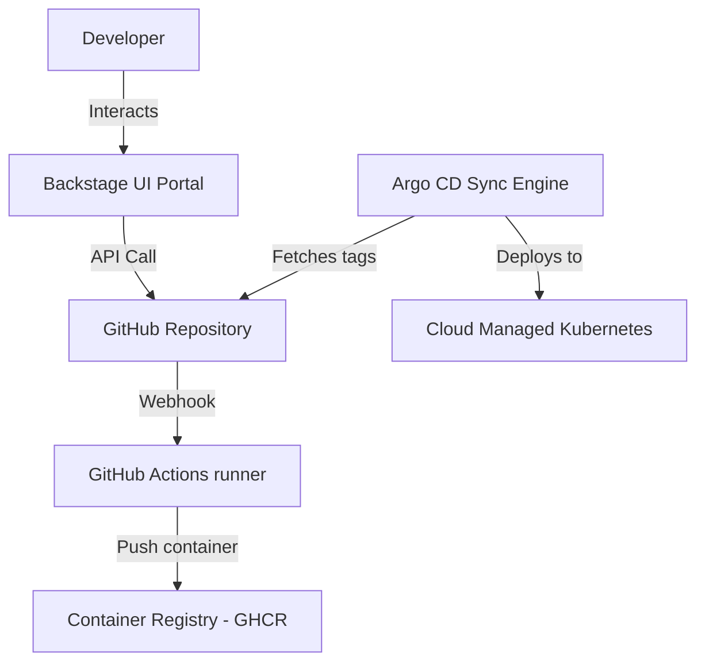

# System Context Model

| Attribute | Value |
| --- | --- |
| **Owner** | Platform Engineering Team |
| **Version** | v1.0.0 |
| **Last Updated** | 2026-06-04 |
| **Generation Timestamp** | 2026-06-04T12:15:00Z |
| **Source References** | [platform-engineering-accelerator](file:///h:/devopsprod4jun26) |
| **Validation Status** | APPROVED |

---

## High-Level System Interactions

The following system context model shows the external interfaces and target platforms:

## Boundaries & Constraints
- **GHCR Registry**: Direct pushes are denied. Container tags can only be created via CI workflows.
- **GitOps model**: Cluster state is reconciled against branch manifests. Direct kubectl write access to tenant namespaces is denied.
