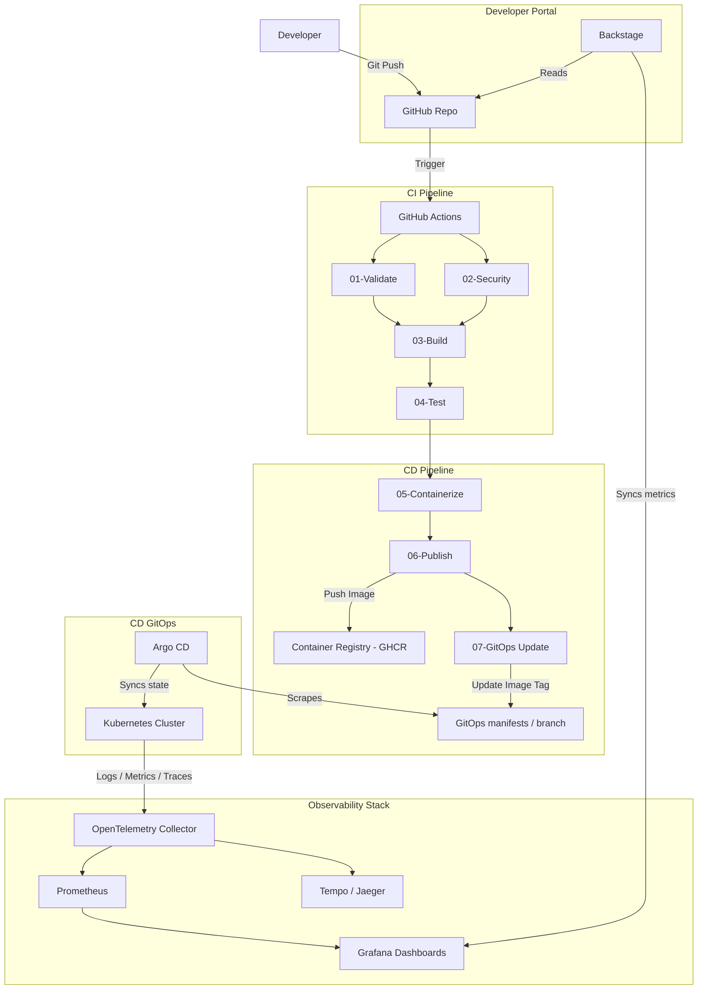

# Architecture Design & Workflow

This document describes the high-level architecture, pipeline flows, and component layouts for the Platform Engineering Accelerator.

## High-Level Architecture Flow

The following Mermaid diagram shows the workflow from developer commits to GitOps-driven deployment and monitoring:

## Component Architecture

1. **Self-Service**: Developers use Backstage Software Templates to register, bootstrap, and deploy services from pre-configured golden templates.
2. **CI/CD**: Workflows are fully componentized and reusable. No duplicated steps.
3. **Infrastructure as Code**: Cloud-agnostic modules provision isolated Virtual Networks, Managed Kubernetes Clusters (AKS/EKS/GKE), Managed Identity, and Key Management.
4. **GitOps Git Engine**: Argo CD maps states in Git to live Kubernetes states. Environments are isolated by namespaces and monitored via Prometheus recording rules.
