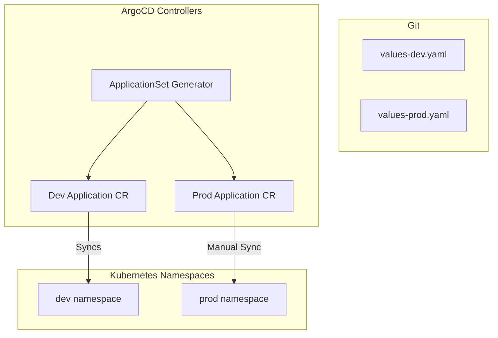

# Deployment Architecture

| Attribute | Value |
| --- | --- |
| **Owner** | Platform Engineering Team |
| **Version** | v1.0.0 |
| **Last Updated** | 2026-06-04 |
| **Generation Timestamp** | 2026-06-04T12:15:00Z |
| **Source References** | [platform-engineering-accelerator](file:///h:/devopsprod4jun26) |
| **Validation Status** | APPROVED |

---

## Argo CD GitOps Deployment Architecture

Workloads are deployed declaratively using GitOps:

## Deployment Specifications

- **ApplicationSet**: Configured at [applicationset.yaml](file:///h:/devopsprod4jun26/platform/argocd/applications/applicationset.yaml). Automatically tracks environment branches and dynamically spawns namespaces and Helm deployments.
- **Sync Options**:
  - **Dev / QA**: Automatic sync enabled with `selfHeal: true` and `prune: true`.
  - **Prod**: Automated sync disabled to guarantee manual verification.
- **Rollout Strategies**: Rollouts can map to RollingUpdate (default), canary deployments, or blue-green strategies defined under [strategies/](file:///h:/devopsprod4jun26/platform/argocd/strategies/).
