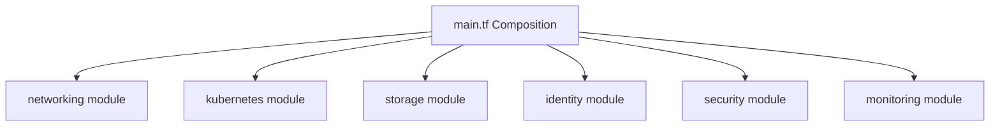

# Infrastructure Architecture

| Attribute | Value |
| --- | --- |
| **Owner** | Platform Engineering Team |
| **Version** | v1.0.0 |
| **Last Updated** | 2026-06-04 |
| **Generation Timestamp** | 2026-06-04T12:15:00Z |
| **Source References** | [platform-engineering-accelerator](file:///h:/devopsprod4jun26) |
| **Validation Status** | APPROVED |

---

## Terraform Module Infrastructure Layout

The infrastructure is provisioned dynamically via cloud-agnostic Terraform modules defined under [modules/](file:///h:/devopsprod4jun26/platform/terraform/modules/):

## Infrastructure Components

1. **Networking**: Configures isolated networks (VPCs/VNets), dividing allocation across private, data, and public subnets.
2. **Kubernetes**: Standardizes deployment of managed control planes (Azure AKS, AWS EKS, or Google GKE) inside the private subnets.
3. **Identity**: Configures Workload Identity mapping Kubernetes service accounts to cloud IAM roles directly.
4. **Security**: Sets up key vault services and restricts ingress API endpoints via custom IP lists.
5. **Storage**: Provision disk storage arrays and backup volume schedules.
