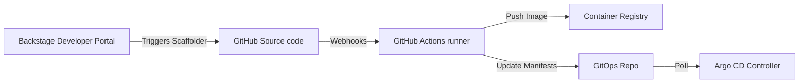

# Integration Architecture

| Attribute | Value |
| --- | --- |
| **Owner** | Platform Engineering Team |
| **Version** | v1.0.0 |
| **Last Updated** | 2026-06-04 |
| **Generation Timestamp** | 2026-06-04T12:15:00Z |
| **Source References** | [platform-engineering-accelerator](file:///h:/devopsprod4jun26) |
| **Validation Status** | APPROVED |

---

## Integration Mapping

## System Interfaces

1. **Backstage Scaffolder API**: Translates user inputs (name, runtime) into custom repository configurations.
2. **GitHub Actions Webhooks**: Responds to push events on `main` or release branches to initiate container builds.
3. **Argo CD Application Controller**: Listens to Git repository updates and triggers target namespace reconciliation.
4. **OTel Collector Exporters**: Routes processed metrics to Prometheus endpoints.
