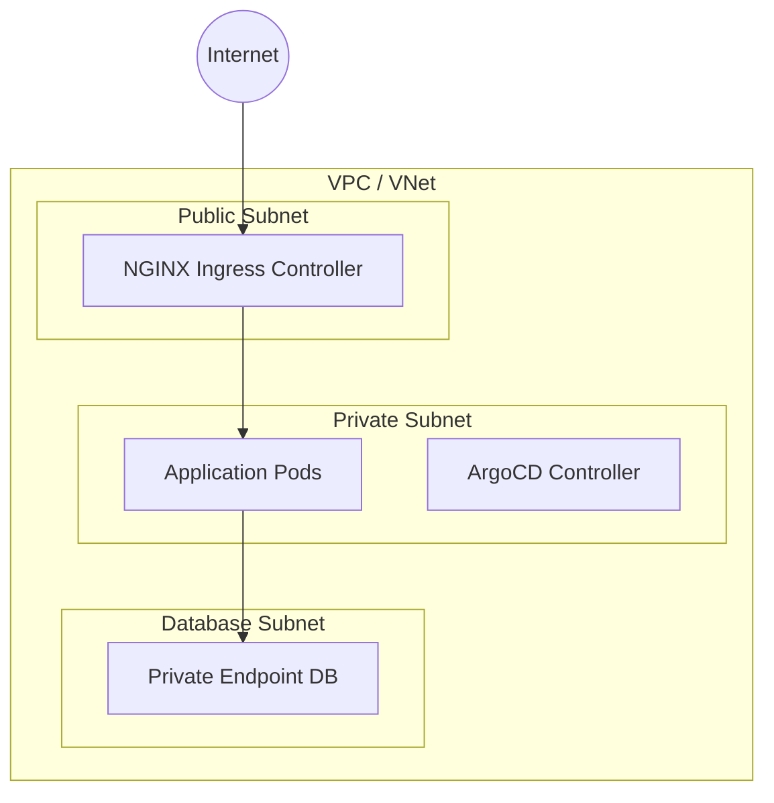

# Network Architecture

| Attribute | Value |
| --- | --- |
| **Owner** | Platform Engineering Team |
| **Version** | v1.0.0 |
| **Last Updated** | 2026-06-04 |
| **Generation Timestamp** | 2026-06-04T12:15:00Z |
| **Source References** | [platform-engineering-accelerator](file:///h:/devopsprod4jun26) |
| **Validation Status** | APPROVED |

---

## VPC & Subnet Isolation Topology

## Network Configuration

- **NGINX Ingress**: Exposed publicly via LoadBalancer services. Terminates TLS traffic and redirects HTTP traffic to HTTPS.
- **Private Subnets**: Houses application nodes. Nodes reach the internet via NAT Gateways; direct inbound ingress routes are denied.
- **Service Mesh / NetworkPolicy**: Restricts pod-to-pod traffic within namespaces.
