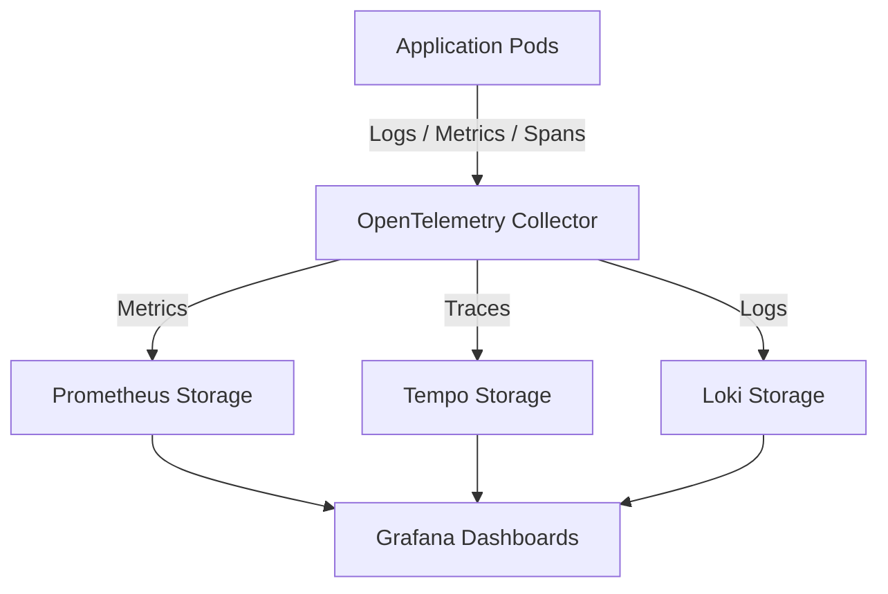

# Observability Architecture

| Attribute | Value |
| --- | --- |
| **Owner** | Platform Engineering Team |
| **Version** | v1.0.0 |
| **Last Updated** | 2026-06-04 |
| **Generation Timestamp** | 2026-06-04T12:15:00Z |
| **Source References** | [platform-engineering-accelerator](file:///h:/devopsprod4jun26) |
| **Validation Status** | APPROVED |

---

## Observability Pipeline Topology

Workload metrics, logs, and trace spans are processed through a consolidated pipeline:

## Observability Specifications

- **Intake**: Auto-instrumentation CRs inject the OpenTelemetry agents into language runtimes.
- **Routing**: OpenTelemetry Collector processes and batch exports datasets.
- **Dashboards**: Standard Grafana dashboards are pre-configured to query metric targets (application latency, error rates, cpu, memory limits, and node capacity).
