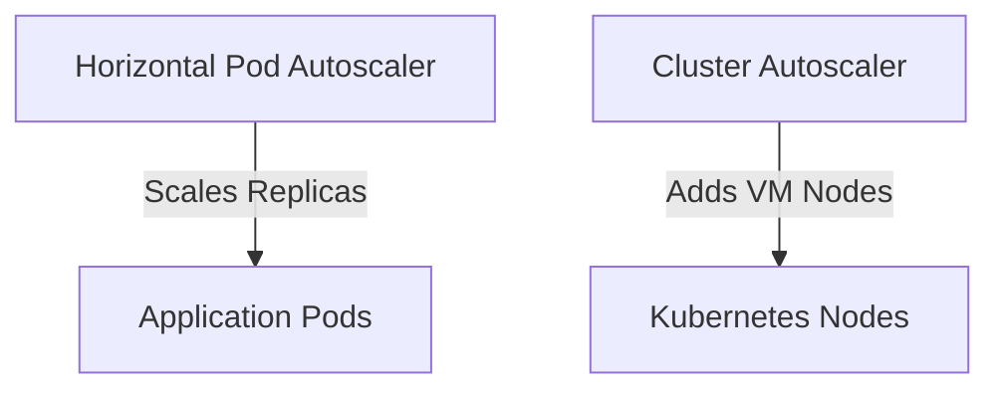

# Scalability Architecture

| Attribute | Value |
| --- | --- |
| **Owner** | Platform Engineering Team |
| **Version** | v1.0.0 |
| **Last Updated** | 2026-06-04 |
| **Generation Timestamp** | 2026-06-04T12:15:00Z |
| **Source References** | [platform-engineering-accelerator](file:///h:/devopsprod4jun26) |
| **Validation Status** | APPROVED |

---

## Scaling Workloads Declaratively

The architecture scales workloads dynamically across multiple vectors:

## Scaling Specifications

- **Horizontal Pod Autoscaler (HPA)**: Configured at [hpa.yaml](file:///h:/devopsprod4jun26/platform/kubernetes/base/hpa.yaml). Triggers additional pod instances based on resource average constraints (CPU > 70% or Memory > 80%).
- **Vertical Pod Autoscaling (VPA)**: Can optionally run in recommendation mode to adjust CPU/Memory requests over time.
- **Terraform Autoscaling Node Pools**: Managed node groups scale VM allocation based on resource consumption needs.
