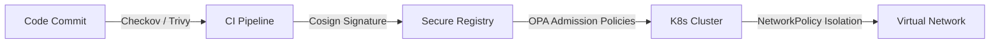

# Security Architecture

| Attribute | Value |
| --- | --- |
| **Owner** | Platform Engineering Team |
| **Version** | v1.0.0 |
| **Last Updated** | 2026-06-04 |
| **Generation Timestamp** | 2026-06-04T12:15:00Z |
| **Source References** | [platform-engineering-accelerator](file:///h:/devopsprod4jun26) |
| **Validation Status** | APPROVED |

---

## Zero-Trust Security Gates

Workload security is enforced at every layer of the deployment cycle:

## Security Mechanisms

1. **Pipeline Validation**: `02-security.yml` scans repository source files for secrets and checks Dockerfiles for root user requirements.
2. **Registry Signatures**: Image tags are cryptographically signed using **Cosign**.
3. **Admission Control**: Open Policy Agent (OPA) evaluates yaml configurations using rego policies. It denies deployments using `:latest` tags or missing liveness/readiness probes.
4. **Network Policy**: Base network policies block cross-namespace pod communication unless explicitly authorized.
