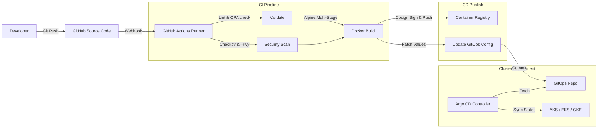

# System Architecture

| Attribute | Value |
| --- | --- |
| **Owner** | Platform Engineering Team |
| **Version** | v1.0.0 |
| **Last Updated** | 2026-06-04 |
| **Generation Timestamp** | 2026-06-04T12:15:00Z |
| **Source References** | [platform-engineering-accelerator](file:///h:/devopsprod4jun26) |
| **Validation Status** | APPROVED |

---

## High-Level System Workflow

This diagram outlines the complete end-to-end integration mapping developers, pipelines, repositories, GitOps sync engines, and cluster namespaces:

## System Topology

1. **GitHub Actions**: Provides isolated runner containers for build validation and code scanning.
2. **GHCR (GitHub Container Registry)**: Functions as our primary registry, enforcing tag immutability.
3. **Argo CD Controller**: Resides inside the cluster (`argocd` namespace) and constantly polls our Git source configuration.
4. **Target Cluster**: Workloads are deployed inside tenant namespaces (`dev`, `qa`, `uat`, `prod`) with network segregation.
