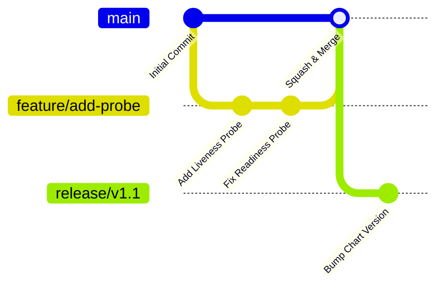

# Branching Strategy

| Attribute | Value |
| --- | --- |
| **Owner** | Platform Engineering Team |
| **Version** | v1.0.0 |
| **Last Updated** | 2026-06-04 |
| **Generation Timestamp** | 2026-06-04T12:15:00Z |
| **Source References** | [platform-engineering-accelerator](file:///h:/devopsprod4jun26) |
| **Validation Status** | APPROVED |

---

## Trunk-Based Git Workflow

This project implements a Trunk-Based Development model to maintain a linear and stable release history.

## Branch Management Rules

1. **Short-Lived Feature Branches**: Feature branches (`feature/*`) must be merged into `main` within 48 hours of creation.
2. **Squash and Merge**: Merges into `main` must use squash merges to maintain a clean linear commit history.
3. **Release Branches**: Created only for tag promotion (`release/*`). Direct commits on release branches are forbidden; hotfixes must be merged to `main` first and backported.
4. **Branch Protection**: Direct pushes to `main` are disabled. All merges require approval from a Code Owner and successful CI pipeline runs.
