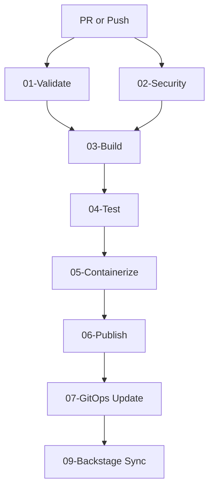

# CI/CD Pipeline Guide

| Attribute | Value |
| --- | --- |
| **Owner** | Platform Engineering Team |
| **Version** | v1.0.0 |
| **Last Updated** | 2026-06-04 |
| **Generation Timestamp** | 2026-06-04T12:15:00Z |
| **Source References** | [platform-engineering-accelerator](file:///h:/devopsprod4jun26) |
| **Validation Status** | APPROVED |

---

## Zero-Touch CI/CD Pipeline Design

Our CI/CD architecture is built on reusable workflows (`.github/workflows/`) called by service-specific configs:

## Pipeline Execution Stages

1. **01-Validate**: Validates YAML formatting, runs `terraform validate`, and evaluates OPA rules using Conftest.
2. **02-Security**: Runs Checkov static analysis, Trivy secrets scanning, and Grype dependency verification.
3. **05-Containerize**: Builds Docker container images, generates SBOMs, and runs image signing.
4. **07-GitOps Update**: Modifies target deployment values files in git, triggering Argo CD reconciliation.
