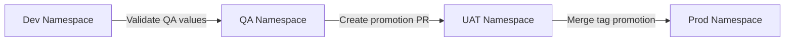

# Operations Deployment Guide

| Attribute | Value |
| --- | --- |
| **Owner** | Platform Engineering Team |
| **Version** | v1.0.0 |
| **Last Updated** | 2026-06-04 |
| **Generation Timestamp** | 2026-06-04T12:15:00Z |
| **Source References** | [platform-engineering-accelerator](file:///h:/devopsprod4jun26) |
| **Validation Status** | APPROVED |

---

## Promotion and Release Lifecycle

We deploy workloads to Kubernetes through isolated promotion stages:

## Stage Validation & Verification

1. **Development (Dev)**:
   - Triggered automatically on merges to `main`.
   - Health check verify runs immediately via Argo CD synchronization status hook.
2. **QA / UAT**:
   - Promotion requires passing integration tests in QA.
   - Values patches are applied to `values-qa.yaml` and `values-uat.yaml` respectively.
3. **Production (Prod)**:
   - Gated by Git tags. Automated synchronization is disabled in `prod-app.yaml` to ensure manual approvals and blue-green validation checks.
