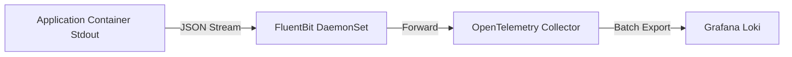

# Logging Guide

| Attribute | Value |
| --- | --- |
| **Owner** | Platform Engineering Team |
| **Version** | v1.0.0 |
| **Last Updated** | 2026-06-04 |
| **Generation Timestamp** | 2026-06-04T12:15:00Z |
| **Source References** | [platform-engineering-accelerator](file:///h:/devopsprod4jun26) |
| **Validation Status** | APPROVED |

---

## Log Ingestion Flow

The platform utilizes a structured logging flow to ensure high search performance and correlation with traces:

## Logging Specifications

- **Format**: All microservices must output logs in standard JSON format (structured logging).
- **Correlation**: Application libraries automatically append trace and span IDs (`trace_id`, `span_id`) to log items.
- **Aggregators**: Standard pipelines batch logs and export them to storage endpoints (e.g. Loki, Elasticsearch, or Azure Log Analytics) with 14 days retention.
