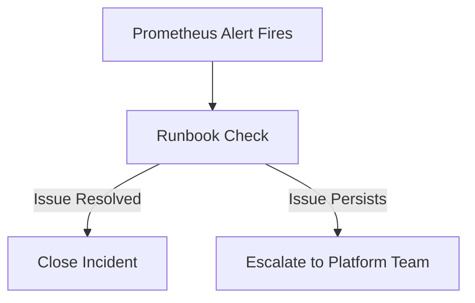

# Operations Runbooks Index

| Attribute | Value |
| --- | --- |
| **Owner** | Platform Engineering Team |
| **Version** | v1.0.0 |
| **Last Updated** | 2026-06-04 |
| **Generation Timestamp** | 2026-06-04T12:15:00Z |
| **Source References** | [platform-engineering-accelerator](file:///h:/devopsprod4jun26) |
| **Validation Status** | APPROVED |

---

## Active Runbooks Catalog

The platform defines structured runbooks for handling common infrastructure alerts:

1. **[High CPU Usage Runbook](file:///h:/devopsprod4jun26/docs/runbooks/high-cpu.md)**: Steps to diagnose CPU throttling and scale replicas.
2. **[Pod Restart & CrashLoop Runbook](file:///h:/devopsprod4jun26/docs/runbooks/pod-crashloop.md)**: Exit code diagnoses (e.g. OOMKilled exit code 137).
3. **[High Latency Runbook](file:///h:/devopsprod4jun26/docs/runbooks/high-latency.md)**: Tracking bottleneck database calls using OpenTelemetry spans.
4. **[Service Unavailable Runbook](file:///h:/devopsprod4jun26/docs/runbooks/service-unavailable.md)**: Resolving ingress routing errors and network policy blocks.

## Incident Escalation Matrix

