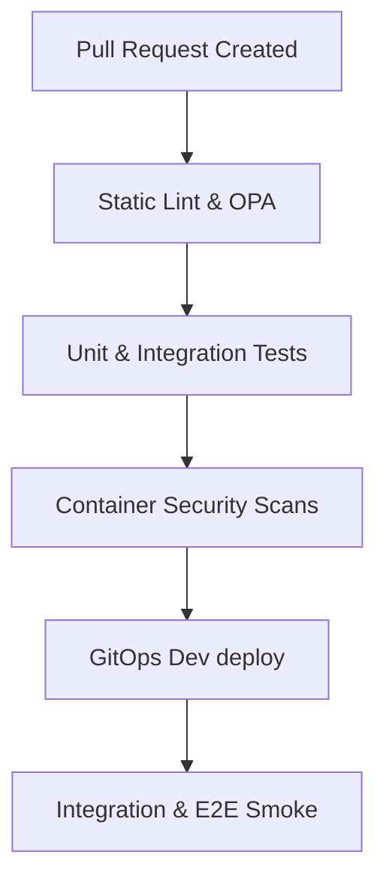

# Test Strategy

| Attribute | Value |
| --- | --- |
| **Owner** | Platform Engineering Team |
| **Version** | v1.0.0 |
| **Last Updated** | 2026-06-04 |
| **Generation Timestamp** | 2026-06-04T12:15:00Z |
| **Source References** | [platform-engineering-accelerator](file:///h:/devopsprod4jun26) |
| **Validation Status** | APPROVED |

---

## Unified Validation Testing Strategy

We implement a multi-tiered test verification strategy to enforce quality:

## Testing Lifecycle

1. **Local Pre-commit**: Developers validate code formatting and OPA rules before push.
2. **Build Verification**: Reusable workflows (`03-build.yml` and `04-test.yml`) run unit test suites per runtime environment.
3. **Registry Gate**: Grype evaluates the SBOM before publishing the container tag.
4. **Integration Gate**: Automated E2E verification tests run against the Dev namespace.
